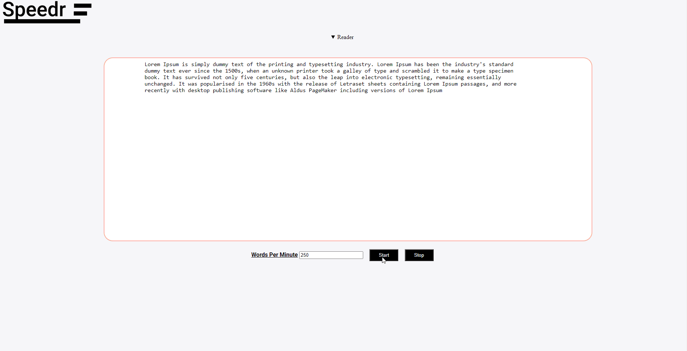

## Speeder

Speedr is a speed reading app that helps you read faster and gain more knowledge

- [Demo Website Speedr](https://speedr.netlify.app/)

## Screenshots

### Screenshots

## Features

Features Done :

- [x] Play / Stop Text

Todo :

- [ ] Improve Design

## Built With

- HTML/CSS
- Vanilla JavaScript

## Author

**Bensaad Soukaina**

- [Linkedin](https://www.linkedin.com/in/soukaina-bensaad/ "Linkedin")

## Support

Contributions, issues, and feature requests are welcome!

Give a ⭐️ if you like this project!

## License

Distributed under the GNU AGPLv3 License. See `LICENSE` File for more information.
